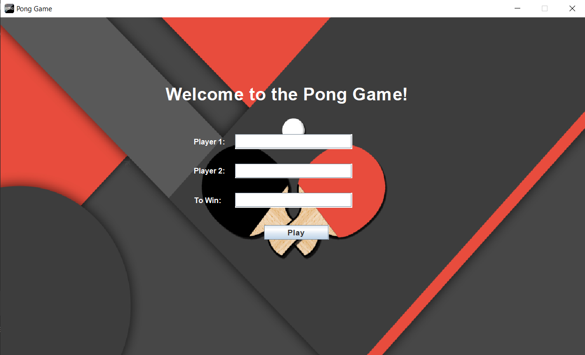
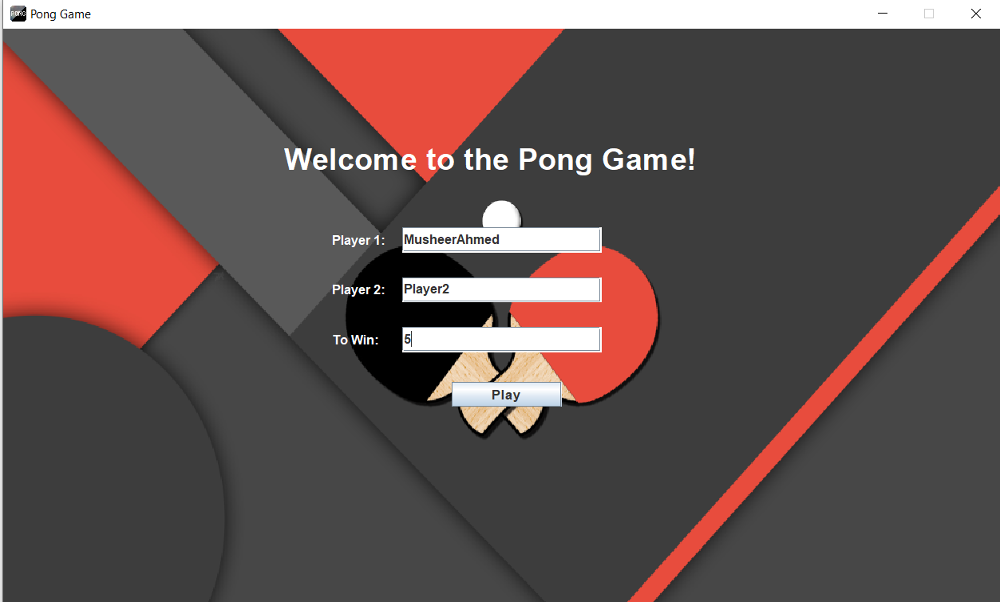
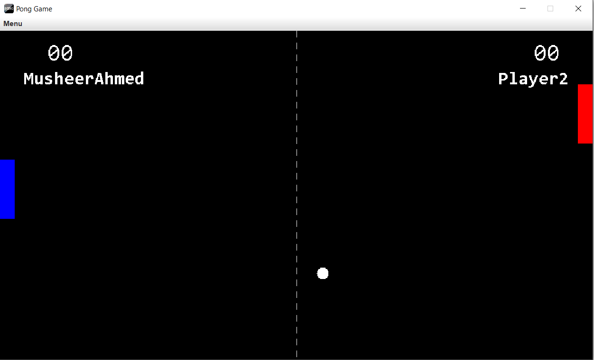
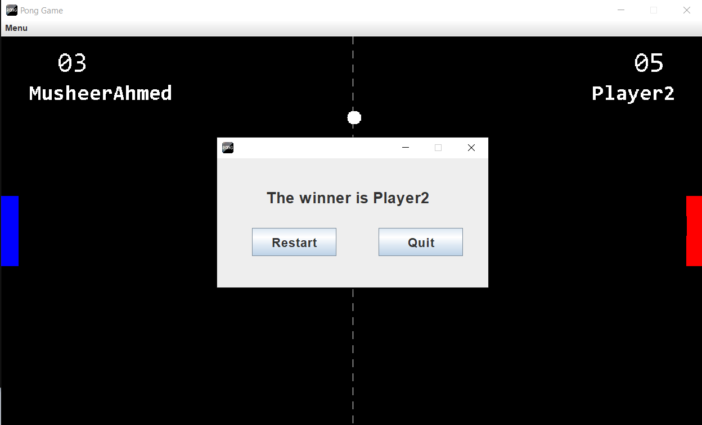

 
  

  <!-- <a href="https://e_commerce_app_flutter.netlify.app">Demo</a> -->

<h1 align="center">Pong Game</h1>

## Status

<h4 align="center">
Pong Game Completed
</h4>

  <a href="#dart-about">About</a> &#xa0; | &#xa0; 
  <a href="#checkered_flag-illustrations">Illustrations</a> &#xa0; | &#xa0;
  <a href="https://github.com/MusheerJ" target="_blank">Author</a>

 

## :dart: About

Build a Desktop game application using Java Swing. 

## :sparkles: Tech Used
:heavy_check_mark: Java\
:heavy_check_mark: Java Swing\
:heavy_check_mark: Intellij Idea

## :checkered_flag: Illustrations

Here are some Illustration of App Screens

|  | 
| :--------------------------------: | 
|            Home Screen             | 

|  | 
| :--------------------------------: | 
|            Input             | 

|  | 
| :--------------------------------: | 
|            Play Screen            | 

|  | 
| :--------------------------------: | 
|            Winner Screen             | 

